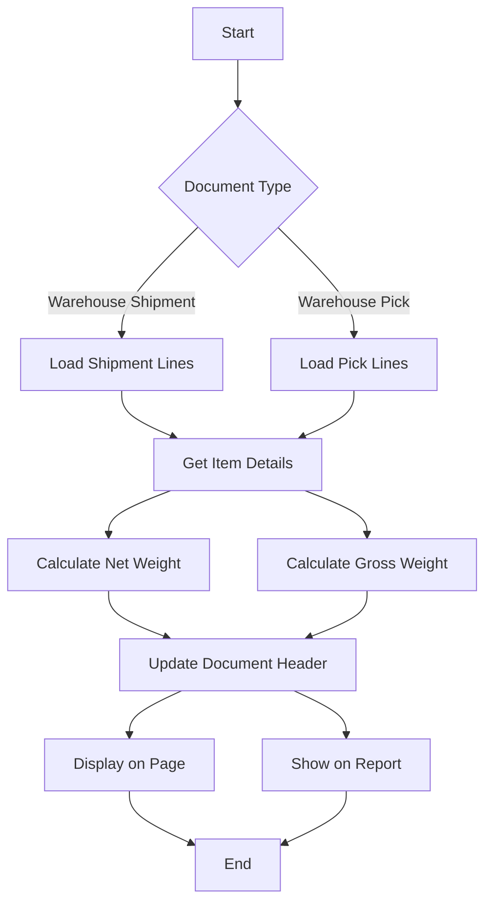
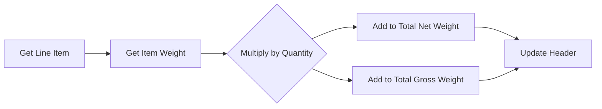

# Warehouse Weight Extension

This extension adds total net weight and gross weight calculations to warehouse shipments and picks in Business Central.

## Features

- Automatic calculation of total net and gross weights for warehouse shipments
- Automatic calculation of total net and gross weights for warehouse picks
- Extended warehouse shipment and pick reports to display weight totals
- Real-time weight calculations when viewing shipments and picks

## Process Flow

## Weight Calculation Logic

## Installation

1. Import the extension to your Business Central environment
2. The functionality will be automatically available on warehouse shipment and pick documents

## Usage

The extension automatically calculates and displays weights when:
- Opening a warehouse shipment
- Opening a warehouse pick
- Printing warehouse shipment reports
- Printing warehouse pick reports

## Technical Details

### Extended Tables
- Warehouse Shipment Header
- Warehouse Pick Header

### Extended Pages
- Warehouse Shipment
- Warehouse Pick

### Extended Reports
- Warehouse Shipment
- Warehouse Pick Instruction

## Permissions

No additional permissions required beyond standard warehouse permissions.

## Dependencies

- Business Central with Warehouse Management enabled
- Base Application

## Known Limitations

- Calculations depend on accurate item weight data being maintained
- Report modifications require corresponding RDLC layout changes
